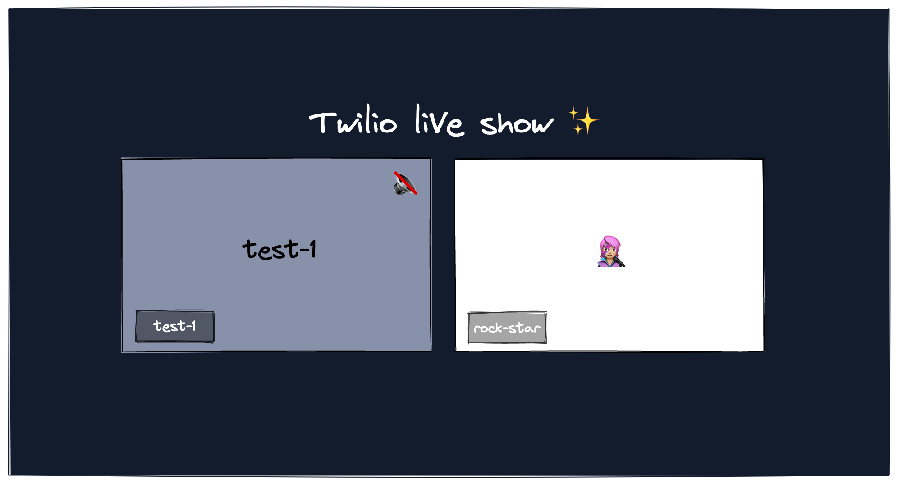

# 🎙 Interview Layout

This Media Extension composes a [Programmable Video](https://www.twilio.com/video) Room's Participants in an interview layout -- a grid layout with a maximum of three Participants.



This is a sample application written in pure JavaScript to demonstrate how to get started with Custom Media Extensions. For more complex scenarios, please take a look at the [`video-composer` sample application](../video-composer) within this repository.

Supported screen resolutions in landscape mode are "1280x720" (default) and "1920x1080".

## 📖 Getting Started 

A Media Extension is a web application that gets loaded by a [MediaProcessor](https://www.twilio.com/docs/live/api/mediaprocessors) and interacts with a [Twilio Video Room](https://www.twilio.com/docs/video/tutorials/understanding-video-rooms#video-rooms) using the [Twilio Video JavaScript SDK](https://github.com/twilio/twilio-video.js). The Media Extension application joins the specified Video Room and displays Participants' media tracks in a specific format. The MediaProcessor then makes the Media Extension application's content available to stream with one of the [Twilio Live SDKs](https://github.com/twilio/twilio-live-player.js).

Learn more about how streaming with Twilio Live works in the [Twilio Live Overview](https://www.twilio.com/docs/live/overview#how-it-works).

To get a feel for how Media Extensions work, we are first going to test out this interview-layout composer extension locally to see it in action. Then we are going to deploy it to the cloud and run it via a Media Processor. 


### 👩‍💻 Local development

#### 1. Install dependencies

Install this project's dependencies from the root of the project. As this project is a [monorepo](https://monorepo.tools/#what-is-a-monorepo), you should install the dependencies from the root folder of the monorepo. Use [npm workspaces](https://docs.npmjs.com/cli/v7/using-npm/workspaces) to install the dependencies.


```bash
# In root of the project
npm install
```

#### 2. Add the necessary account credentials

Create a file called `.env` by copying the `.env.example` file in this folder:

```bash
# in apps/interview-layout folder
cp .env.example .env
```

Edit this `.env` file and substitute your account credentials for the placeholder values for the following variables:

* `TWILIO_ROOM_NAME`: The name of the Video Room the Media Extension will join and stream.
* `TWILIO_API_KEY` and `TWILIO_API_SECRET`: Your API Key SID and Secret. You can generate an API Key in the [Twilio Console](https://www.twilio.com/console/runtime/api-keys). **You must create this key in the US1 region**.
* `TWILIO_ACCOUNT_SID`: Used to generate an Access Token for the Media Extension to join the Video Room. You can find this value in the [Twilio Console](https://www.twilio.com/console) under **Account Info**.

> **Note**: You don't need to edit the `TWILIO_ACCESS_TOKEN` value in the `.env` file, since it will be automatically generated at runtime.

#### 3. Set up the Video React App

To test this Media Extension locally, we recommend you deploy your own version of Twilio's [Video React App](https://github.com/twilio/twilio-video-app-react). Make sure that when you deploy the React App, you use the same `ACCOUNT_SID` as the one you included in this project's `.env` file, so that this Media Extension can join the Room you create. You'll provide your account credentials for the Video React App when you [login to the Twilio CLI](https://github.com/twilio/twilio-video-app-react#login-to-the-twilio-cli).

When you run this Custom Media Extension locally, it will join a Video Room with the name that you provide in your `.env` file (the `ROOM_NAME` variable). Then, when other Participants join that Room (via your deployed React App, for example), this Custom Media Extension will display their video tracks in a grid and play their audio tracks. (Note that when you run this Media Extension in production on a MediaProcessor, it will get the Video Room Name from the `ExtensionContext`.)

> **Note**: If you have your own Twilio Video application that you use to create and join Rooms, you can use that rather than Video React App. The Account SID that you use to create Video Rooms in that application must also match the Account SID you provide here, and the Room name you create must also match the `ROOM_NAME` environment variable here.

#### 4. Run the Media Extension

Now you can bootstrap the application. Run the following command from the `apps/interview-layout` directory. It will launch a browser window with a live stream of the Video Room that you specified in your `.env` file.

```bash
# run this command from apps/interview-layout
npm run start
```

> **Note**: if you do not have [Client-Side (Ad-hoc) Room Creation](https://www.twilio.com/docs/video/tutorials/understanding-video-rooms#ad-hoc-rooms) enabled for your account, another Participant must join the Video Room before you start this Media Extension application. If you start this Media Extension application before any other Participants join the Room and do not have Client-Side Room Creation enabled, the Media Extension will not be able to connect to the Room.

#### Troubleshooting no video and browser autoplay policies

Most browsers have [disabled autoplay](https://developer.chrome.com/blog/autoplay/), meaning that media cannot play without human intervention (such as a user clicking a button to unmute or play a video). Depending on your browser setup and version, your video stream might not be displayed or might show up without audio when you run this Media Extension locally.

To resolve this locally, launch [Chromium](https://www.chromium.org/Home/) with a flag to disable this feature: `--autoplay-policy=no-user-gesture-required`. 

```bash
./Chromium --autoplay-policy=no-user-gesture-required
```

Alternatively, you can use the [Chrome](https://www.google.com/chrome/) browser with the same flag.

```bash
/Applications/Google\ Chrome.app/Contents/MacOS/Google\ Chrome --autoplay-policy=no-user-gesture-required
```

### 📓 Locally updating and testing the application

Every Media Extension that runs on a Twilio MediaProcessor populates a `window.context`, which contains environment variables that you will need to use within your custom Media Extension application. For example, in this sample application, we populate the `window.context` object with the access token to connect to the Video Room:

```js
window.context = {
  TWILIO_ACCESS_TOKEN: 'eyJhxxxxxxxxxx'
}
```

If you need additional environment variables within this `window.context`, you can pass them in the `ExtensionEnvironment` body when you create the MediaProcessor:

```shell
curl -X POST 'https://media.twilio.com/v1/MediaProcessors' \
  -u 'SKXXXXXXXXXXXXXXXXXXXXXXXXXXXXXXXX:your_api_key_secret' \
  -d 'Extension="https://YOUR_CUSTOM_URL_ADDRESS-8718.com"' \
  -d 'ExtensionContext={"room": {"name": "RM123"}, "outputs": ["VJXXX"]}'
  -d 'ExtensionEnvironment={"INTERVIEW_TITLE": "Twilio Live Show"}
```

> **Note**: The MediaProcessor prefixes variables within the `ExtensionEnvironment` with `ENV_` and passes them to the Media Extension. The `INTERVIEW_TITLE` passed above will be accessible as `window.context.ENV_INTERVIEW_TITLE` within the Media Extension's application.

In order to emulate this locally without connecting to a MediaProcessor you would need to hardcode the `window.context` values. You can see how we emulate these variables in line 3 to 12 in `src/main.js`:

```js
if (process.env.NODE_ENV !== 'production') {
  // These variables will be provided by a MediaProcessor and be accessible within the window.context object.
  // In local development we need to fake them in order to "simulate" the MediaProcessor.
  window.context = {
    TWILIO_ACCESS_TOKEN: process.env.TWILIO_ACCESS_TOKEN,
    ENV_INTERVIEW_TITLE: 'Interview with John Doe',
  };
}
```

## 🚀 Deploying your app

To deploy the application, you can use any of your favorite cloud hosting services or [Twilio Functions](https://www.twilio.com/docs/runtime/functions) ✨, which is already configured to deploy your build in Twilio's serverless cloud. The steps below cover how to deploy this Media Extension to a Twilio Function.

### 1. Build the application

Once you want to test out your application in a real scenario, you will need to build it. For this sample application, we decided to use [`parcel`](https://parceljs.org/) as a bundler, but it is not necessary. You could instead fit all the css and js into a single `html` file.

Run the following command to build and bundle our application:

```bash
# run this command from the monorepo's root folder
npm run build:interview
```

### 2. Add your account credentials to the root `.env` file

In the root of this monorepo, create a new `.env` file by copying the `.env.example`:

```bash
# in the root of this monorepo
cp .env.example .env
```

Edit this `.env` file and substitute your account credentials for the placeholder values for the following variables:

* `ACCOUNT_SID` and `AUTH_TOKEN`: You can find these values in the [Twilio Console](https://www.twilio.com/console) under **Account Info**.

### 3. Run the deploy script

The command below deploys this project to a Twilio Function, using the account credentials you provided in the `.env` file.

```bash
# run this command from the monorepo's root folder
npm run deploy:interview
```

It will output something like the following:
```bash
...
✔ Serverless project successfully deployed

Deployment Details
Domain: interview-layout-quickstart-5226-dev.twil.io
```

Awesome! You Custom Extension is now available for everyone and ready to be used within a Twilio MediaProcessor 🎉

### 4. Provide the Media Extension URL to a MediaProcessor

When you create a MediaProcessor, you should provide the URL of the deployed (the output `Domain` in the example above) as the `Extension` parameter's value.

```shell
curl -X POST 'https://media.twilio.com/v1/MediaProcessors' \
  -u 'SKXXXXXXXXXXXXXXXXXXXXXXXXXXXXXXXX:your_api_key_secret' \
  -d 'Extension="interview-layout-quickstart-5226-dev.twil.io"'\
  ...
```
